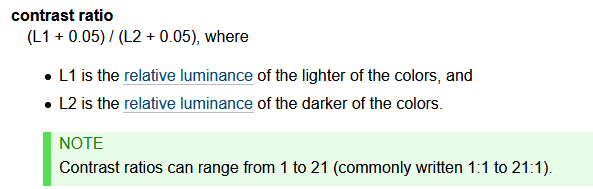

# Accessibility Requirements

## Specifications
### Quick Items

[Orientation](https://www.w3.org/TR/WCAG21/#orientation)
The page can switch between landscape mode and portrait mode.

**Keyboard**
The page can be fully functional using just the keyboard. 
The element that is focused on has a visible indicator. (When tabbing there is a box or other indicator around focused element)

**Animations**
Motion animation can be disabled

[Reading Level](https://www.w3.org/TR/WCAG21/#understandable)
Keep language around 6th grade comprehension level.

[Pointer Target Size](https://www.w3.org/TR/WCAG21/#target-size)
The size of the target for pointer inputs is at least 44 by 44 CSS pixels.

**Labeling of Elements in Program**
Make the programmatic label (name="Submit") of text or button the same as the text displayed on screen.

[Content can be read by a screen reader](https://www.w3.org/TR/WCAG21/#robust)
- Content is programmed correctly
- Name and role of components can be determined by reading the attributes.
- Statuses will be announced by a screen reader [Further Information](https://www.w3.org/WAI/WCAG21/Understanding/status-messages.html)

##
**Contrast** between elements and background needs to be of a certain ratio, determined by this formula. [https://www.w3.org/TR/WCAG21/#contrast-minimum](https://www.w3.org/TR/WCAG21/#contrast-minimum) 

Minimum Ratio for large text (18pt or 14pt bolded) is **3:1**, normal text is **4.5:1** 

Best Ratio for large text (18pt or 14pt bolded) is **4.5:1**, normal text is **7:1** 

Logos do not matter.

Buttons need a **3:1** contrast ratio, except for when inactive.

[Decoration, Formatting, Invisible](https://www.w3.org/TR/WCAG21/#non-text-content)
If non-text content is [pure decoration](https://www.w3.org/TR/WCAG21/#dfn-pure-decoration), is used only for visual formatting, or is not presented to users, then it is implemented in a way that it can be ignored by [assistive technology](https://www.w3.org/TR/WCAG21/#dfn-assistive-technologies). 

[Sensory Characteristics](https://www.w3.org/TR/WCAG21/#sensory-characteristics)
Instructions provided for understanding and operating content do not rely solely on sensory characteristics of components such as shape, color, size, visual location, orientation, or sound.

[Use of color](https://www.w3.org/TR/WCAG21/#use-of-color)
Color is not used as the only visual means of conveying information, indicating an action, prompting a response, or distinguishing a visual element.

[Visual Presentation of Content](https://www.w3.org/TR/WCAG21/#visual-presentation) [Further Reading](https://www.w3.org/WAI/WCAG21/Understanding/visual-presentation.html)
- Foreground and background colors can be selected by the user.
- Width is no more than 80 characters or glyphs
- Line spacing is at least space-and-a-half (150%) within paragraphs, and paragraph spacing is at least 1.5 (250%) times larger than the line spacing.
- Text can be resized without assistive technology up to 200 percent in a way that does not require the user to scroll horizontally to read a line of text on a full-screen window.
- Text doesn't require the user to scroll horizontally up to 400% zoom.
- Text is not justified (aligned to both the left and the right margins). 
Some people struggle reading text that is both left and right justified. The uneven spacing between words in fully justified text can cause "rivers of white" space to run down the page making reading very difficult. Text justification can also cause words to be spaced closely together, so that it is difficult to locate word boundaries.

Content is not broken by setting these properties to text:

- Line height (line spacing) to at least 1.5 times the font size;
- Spacing following paragraphs to at least 2 times the font size;
- Letter spacing (tracking) to at least 0.12 times the font size;
- Word spacing to at least 0.16 times the font size.

[Content on Hover or Focus](https://www.w3.org/WAI/WCAG21/Understanding/content-on-hover-or-focus.html)

Content that is triggered on hover/focus can be easily dismissed (through pressing Esc) or ignored (content does not block other content on page)
Content will stay on the screen if the mouse is hovered over that content and not it's original trigger.

[Click Event Further Information](https://www.w3.org/WAI/WCAG21/Understanding/pointer-cancellation.html)
This is to allow users to cancel accidental clicks (specifically mouse down).

## Useful Website Links
[Interagency Committee on Disability Research](https://icdr.acl.gov/)

[WCAG21 Main Website](https://www.w3.org/TR/WCAG21/#abstract)

[Free Screen Reader (One of the top used)](https://www.nvaccess.org/)

## Four Principles of Accessibility

1.  **Perceivable** - Information and user interface components must be presentable to users in ways they can perceive.
    - This means that users must be able to perceive the information being presented (it can't be invisible to all of their senses)
2.  **Operable** - User interface components and navigation must be operable.
    - This means that users must be able to operate the interface (the interface cannot require interaction that a user cannot perform)
3.  **Understandable** - Information and the operation of user interface must be understandable.
    - This means that users must be able to understand the information as well as the operation of the user interface (the content or operation cannot be beyond their understanding)
4. **Robust** - Content must be robust enough that it can be interpreted reliably by a wide variety of user agents, including assistive technologies.
    - This means that users must be able to access the content as technologies advance (as technologies and user agents evolve, the content should remain accessible)

<!--stackedit_data:
eyJoaXN0b3J5IjpbMTQ4Njg1MTIyMl19
-->