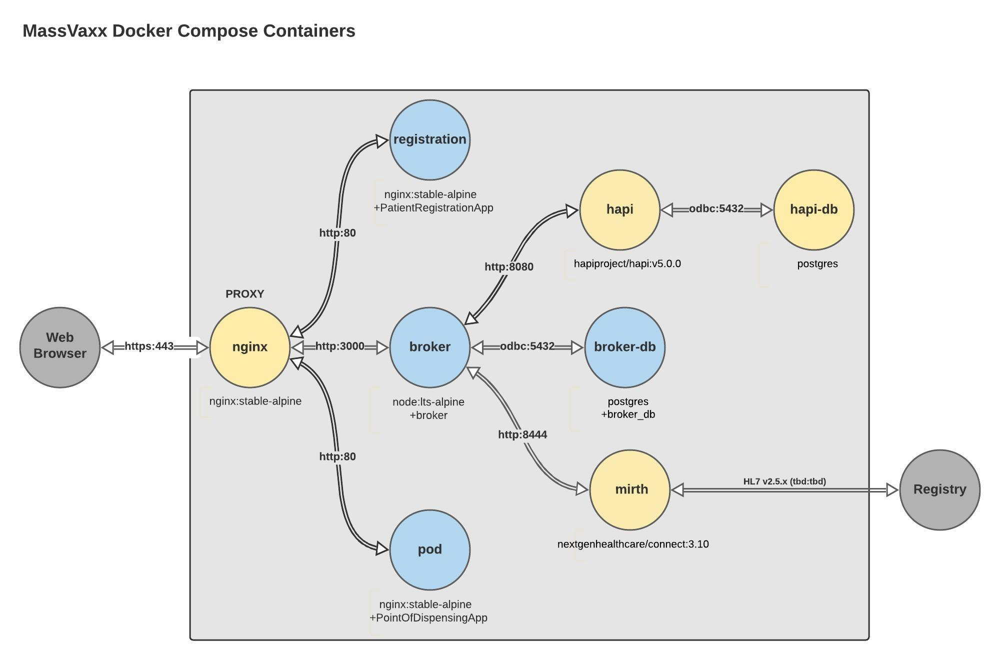

# MassVaccinationSystem Sandbox
The files contained here will allow you to run all the required components/services for 
a complete system on one workstation or server using Docker.

## How to run sandbox
1. Install [Docker Compose](https://docs.docker.com/compose/install/) and any dependencies.
2. In sandbox directory, generate certificates for https connections (Windows users may need
to install an OpenSSL binary):

        openssl req -newkey rsa:2048 -nodes -keyout sandbox.key -x509 -days 365 -out sandbox.crt

3. Navigate to MassVaccinationSystem directory with the docker-compose.yml file and run:

        docker-compose -p massvaxx up

    Or, if you want the services to run in the background, use:

        docker-compose -p massvaxx up -d

    To stop the containers:

        docker-compose -p massvaxx stop

    To clean up the containers and resources after stopping:

        docker container prune
        docker network prune
        docker volume prune

## Connecting to sandbox using a browser
- All http requests will be redirected to https.
- PatientRegistrationApp will be at https://<your_ip_address_or_host>/Registration (e.g., https://demo.massvaxx.com/Registration)
- PointOfDispensingApp will be at https://<your_ip_address_or_host>/POD (e.g., https://mypc.local/POD)
- Broker endpoints will be at https://<your_ip_address_or_host>/broker/<endpoint> (e.g., https://192.168.0.100/broker/healthcheck)

Direct access to the other services is not provided with the default docker-compose.yml.
To expose the other services, uncomment the ports as neccessary and re-run 'docker-compose up'. You may need to do this to configure some things.

## Certificate for https
**Note:** The certificate created above for https is self-signed, so you will need to use a browser that allows that and accept the warnings. Alternatively, you can use [Let's Encrypt](https://letsencrypt.org/) to get a real certificate. This will require you to have a subdomain with an A or AAAA record pointing to your IP address.
