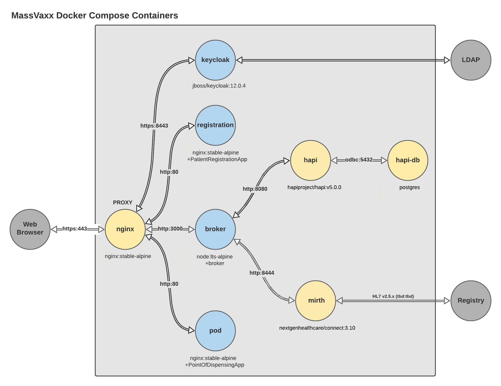
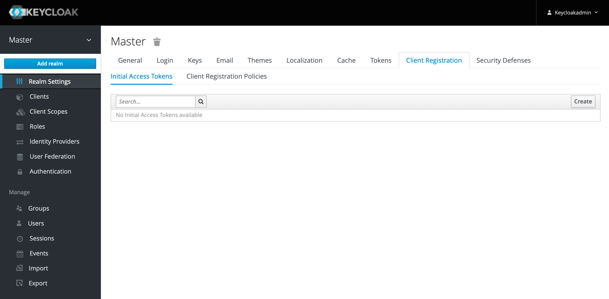
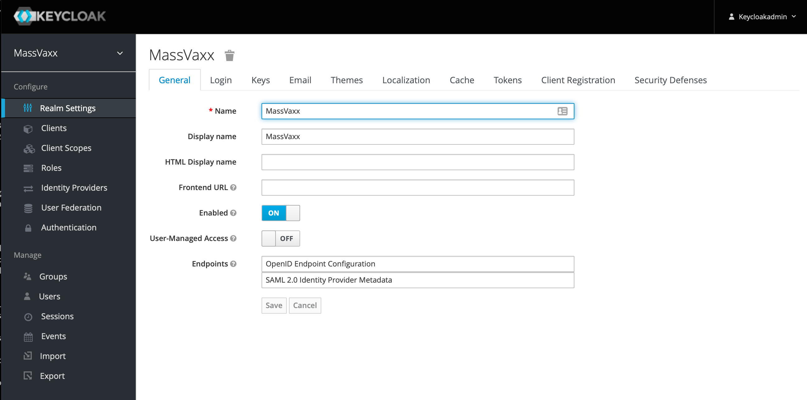
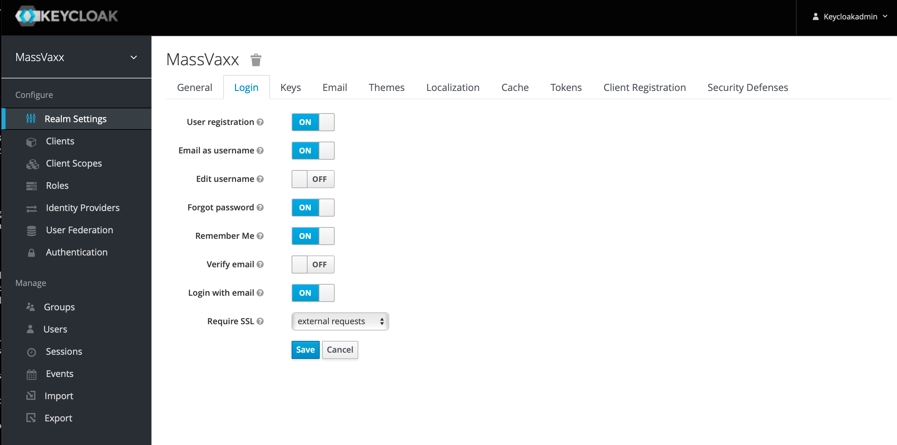

# MassVaccinationSystem Sandbox
The files contained here will allow you to run all the required components/services for 
a complete system on one workstation or server using Docker. Use this as a starting point for
your own installation.

## Prerequisites:
- [Docker Compose](https://docs.docker.com/compose/install/) and any dependencies are installed.
- MassVaccinationSystem project source code downloaded.
- See  for using Linux Ubuntu as the Docker host.

## Steps:
1. In sandbox directory, generate self-signed certificates for https connections (Windows users may need
to install an OpenSSL binary):

        openssl req -newkey rsa:2048 -nodes -keyout sandbox.key -x509 -days 365 -out sandbox.crt

   If you have a fully-qualified domain name (FQDN) and a DNS A record that directs the FQDN to your Docker host's IP address, see the **Certicate for https** section below for instructions on how to use the Let's Encrypt certificate authority (CA) to generate and use a certificate recognized by browsers.

2. In sandbox directory, copy **env.template** to a file named **.env** (note the dot in .env filename).
3. In sandbox directory, copy **hapi.properties.template** to a file named **hapi.properties**.
4. (Optional) Edit .env and hapi.properties file to change default database password (_HAPI_DB_PASSWORD_). Make sure the user, database name, and passwords match in .env and hapi.properties.
5. (Optional) Edit .env to change default keycloak administrator user and password (_KEYCLOAK_USER_ and _KEYCLOAK_PASSWORD_).
6. Navigate to MassVaccinationSystem sandbox directory with the docker-compose.yml file and run:

        docker-compose -p massvaxx up

    Or, if you want the services to run in the background, use:

        docker-compose -p massvaxx up -d

7. Set up realm and accounts as described in **Keycloak** section below.

## Connecting to sandbox using a web browser
**NOTE**: Some browsers (e.g. Chrome) will not allow connections to sites using a self-signed certificate.

**NOTE**: If you chnaged the port value in the .env file, you will need to add the port to the URLs below (e.g., http://\<your_ip_address_or_host\>:\<port\>).

Others will require acknowledging the security rish to enter the site. See below for how to set up a
recognized certificate if needed.
- All http requests will be redirected to https.
- **PatientRegistrationApp** will be at:

    https://\<your_ip_address_or_host\> (e.g., https://demo.massvaxx.com)

- Alternatively, PatientRegistrationApp will also be at:   

    https://\<your_ip_address_or_host\>/Registration (e.g., https://demo.massvaxx.com/Registration) 

- **PointOfDispensingApp** will be at:  

    https://\<your_ip_address_or_host\>/POD (e.g., https://mypc.local/POD)

- **Broker endpoints** will be at:  

    https://\<your_ip_address_or_host\>/broker/\<endpoint\> (e.g., https://192.168.0.100/broker/healthcheck)

- **Keycloak console** will be at:  

    https://\<your_ip_address_or_host\>/auth (e.g., https://demo.massvaxx.com/auth)

Direct access to the other services is not provided with the default docker-compose.yml.
To expose the other services, uncomment the ports as neccessary and re-run 'docker-compose up'. You may need to do this to configure some things.

## Keycloak Configuration

1. Login to Keycloak console at https://\<your_ip_address_or_host\>/auth using the user and password defined in the .env file.
2. Initially you will be logged into the _Master_ realm. Add a new realm using the _Add Realm_ button found when you click on the drop down in the upper left:

3. On the _Add Realm_ form, set **Name** to _MassVaxx_ and click **Create**. You will then be switched to the MassVaxx realm:

4. Click the _Login_ tab and set the switches to match the screenshot below and then click **Save**.

5. Add a new client for MassVaxx applications. Select the **Clients** in the left column and then click the **Create** button on the upper right of the Clients list form. On the _Add Client_ form, set **Client ID** to _massvaxx_ and click **Save**.

6. Users can now register themselves using the account URL found in the list of **Clients**. It will be https://\<your_ip_address_or_host\>/auth/realms/MassVaxx/account/ (e.g., https://massvaxx-keycloak.mooo.com/auth/realms/MassVaxx/account/).

    NOTE: After a successful registration via the link above, an error page may be displayed. Going back to the original URL will allow the new user to access their account settings.

7. Other identity providers can be configured using the functions on the left panel of the Keycloak administrative console.

## Stopping and cleaning up
- To stop the containers:

        docker-compose -p massvaxx stop

- To clean up the containers and resources after stopping:

        docker-compose -p massvaxx down

## Security and Optional Setup Notes
- If you wish to change other settings in the default docker-compose.yml, you can make a copy and then specify the copy in the docker-compose command:

        docker-compose -f docker-compose-copy.yml -p massvaxx up -d

- A firewall for the Docker host should be enabled and block connections to the back-end services, especially if you have exposed them for configuration. Only access to ports 80 (http) and 443 (https) should be required. The firewall should also be tested to make sure if those ports are disabled, the system cannot be accessed. Some firewalls have known interactions with Docker (e.g., Ubuntu's ufw https://github.com/docker/for-linux/issues/690).
- Protect .env and hapi.properties files to allow only Docker has read access (e.g., On Linux, 'chown root:root .env hapi.properties && chmod 400 .env hapi.properties').
- The database files may not be encrypted. An encrypted file system is highly suggested.
- The database files should be backed up and a restore tested.
- Apply OS and package updates on Docker host reqularly and often.
- The containers might be run on multiple hosts. That exercise is left to interested deployer.

## Certificate for https
The certificate created above for https is self-signed, so you will need to use a browser that allows that and accept the warnings. Alternatively, you can use [Let's Encrypt](https://letsencrypt.org/) to get a real certificate. This will require you to have a FQDN (e.g., demo.massvaxx.com) with an A or AAAA record pointing to your IP address. Refer to the niginx.conf and .env files for mapping existing certificate files for use by the proxy container.

If you are using a Linux distro as your Docker host and would like the use Let's Encrypt, the following changes should allow you to create and use your own cert (prepend commands with sudo if not running as root):

1. Install certbot. For Ubuntu 20.04 TLS this can be done by:

        snap install --classic certbot

2. Run certbot in standalone mode to create the certificates:

        certbot certonly --standalone

    Enter the data required at the prompts.

4. Edit .env file, replace the following lines:

        PROXY_VOLUME_MAP1=./nginx.conf:/etc/nginx/nginx.conf
        PROXY_VOLUME_MAP2=./sandbox.crt:/etc/nginx/sandbox.crt
        PROXY_VOLUME_MAP3=./sandbox.crt:/etc/nginx/sandbox.key

    with (replace \\<FQDN\\> with your FQDN):

        PROXY_VOLUME_MAP1=./nginx-letsencrypt.conf:/etc/nginx/nginx.conf
        PROXY_VOLUME_MAP2=./certs:/etc/certs
        PROXY_VOLUME_MAP3=./dummy:/etc/dummy

5. Need to do some additional steps to get certificates into proxy container in sandbox directory:

        mkdir <sandbox_dir>/certs
        mkdir <sandbox_dir>/dummy
        cp /etc/letsencrypt/live/<FQDN>/fullchain.pem <sandbox_dir>/sandbox/certs
        cp /etc/letsencrupt/live/<FQDN>/privkey.pem <sandbox_dir>/certs        

6. Periodically refresh your certificate (Let's Encrypt certs expire after 90 days, but can be renewed after 60 days):

        certbot renew
        cp /etc/letsencrypt/live/<FQDN>/fullchain.pem <sandbox_dir>/certs
        cp /etc/letsencrupt/live/<FQDN>/privkey.pem <sandbox_dir>/certs 

    Suggestion is to set this up as a cron job to avoid having certs expire.
